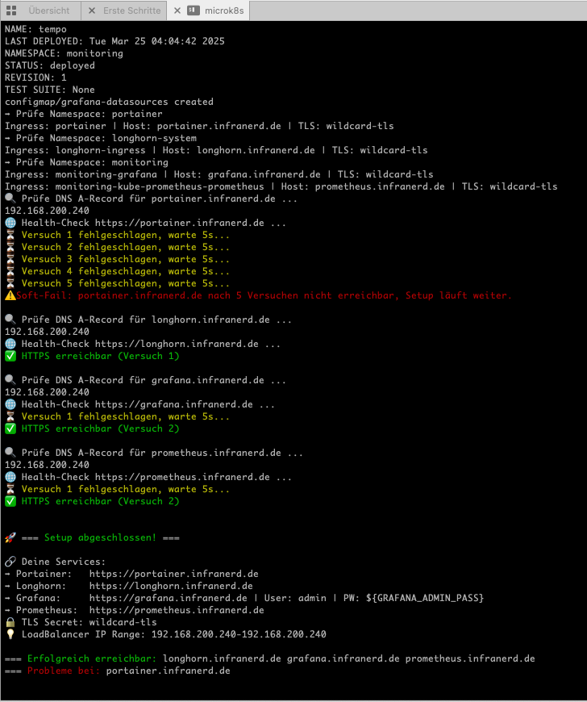
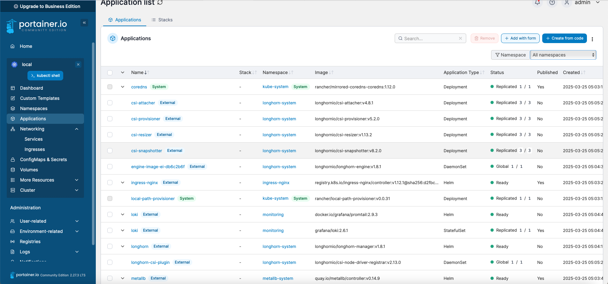
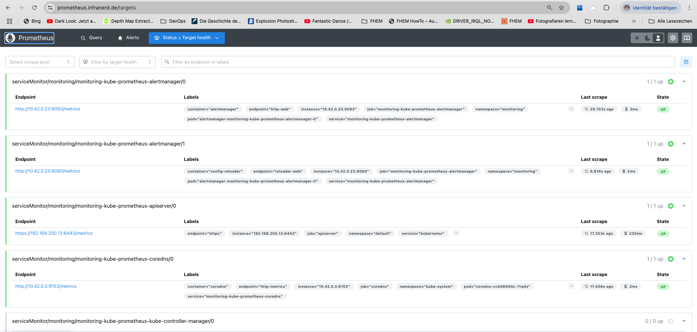
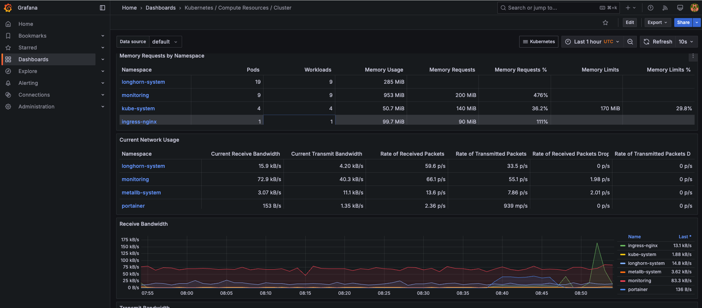
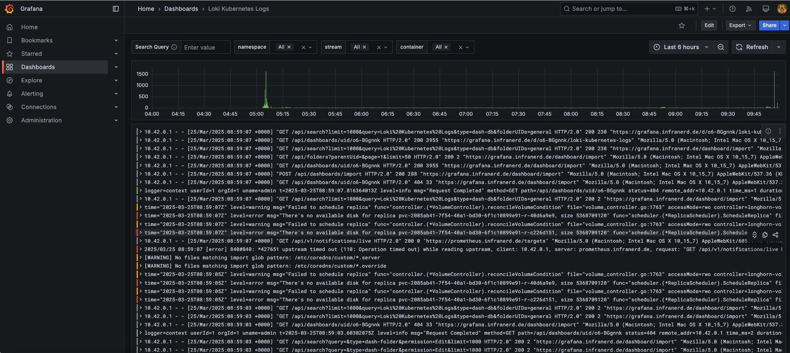

# 🚀 DevOps Homelab K3s

Willkommen zu meinem DevOps Homelab Setup – einem vollständig automatisierten Kubernetes-Cluster basierend auf [K3s](https://k3s.io), das moderne Self-Hosting-Tools wie Portainer, Longhorn und Grafana integriert. Ziel dieses Projekts ist es, eine modulare, wartbare und CI/CD-fähige Infrastruktur für Self-Hosted-Anwendungen aufzubauen – ganz im Sinne von Infrastructure-as-Code.

---

## 🔍 Projektüberblick

Dieses Projekt richtet sich an alle, die Kubernetes im Homelab oder in kleinen produktionsnahen Umgebungen automatisiert betreiben möchten. Die gesamte Konfiguration erfolgt über Shell-Skripte, Helm-Charts und ENV-Variablen – vollständig reproduzierbar und anpassbar.

### Was dieses Setup bietet:

- ⚙️ Automatisiertes **K3s-Cluster Setup** (Single Node oder HA möglich)
- 🧱 Integration von Tools wie **Portainer**, **Longhorn**, **Ingress-NGINX** und **Monitoring**
- 🔐 **TLS-Handling mit Wildcard-Zertifikaten** (zentrale Verteilung in alle relevanten Namespaces)
- 🔄 **Auto-Restart Hooks** für wichtige Deployments (Portainer, Longhorn, Grafana)
- 📈 **Monitoring** via Prometheus, Grafana und optionalen Alerts
- 🧪 **GitHub Actions CI** zur Code-Qualitätssicherung (ShellCheck, Manifest Checks)
- 🧩 Modulares Design durch ENV-Dateien und Helm-Values

---

## 🧰 Verwendete Technologien

| Bereich            | Tools / Technologien                       |
|--------------------|--------------------------------------------|
| Kubernetes         | [K3s](https://k3s.io), Helm, kubectl       |
| Netzwerk & TLS     | Ingress-NGINX, MetalLB, IONOS Wildcard-Zertifikat |
| Self-Hosting Tools | Portainer CE, Longhorn                     |
| Monitoring         | Prometheus, Grafana                        |
| Automation         | Bash, GitHub Actions, ENV-Vorlagen         |

---

## 📦 Projektstruktur

```bash
.
├── Install_k3s.sh                # Haupt-Setup-Script für das Cluster
├── configs/                      # Helm Values & Manifest-Vorlagen
├── env/                          # Beispielhafte ENV-Dateien
├── actions/                      # GitHub Actions Workflows (CI)
├── certs/                        # TLS-Zertifikat Integration
└── README.md                     # Dieses Dokument
```

---

## 🚀 Schnellstart

1. 🔧 Passe deine `.env`-Dateien an (siehe `env/`).
2. 🔐 Hinterlege dein Wildcard-Zertifikat in `certs/`.
3. ▶️ Starte das Setup:
   ```bash
   chmod +x Install_k3s.sh
   ./Install_k3s.sh
   ```

---

## 📸 Vorschau (optional)

> *(Optional – hier kannst du Screenshots von z. B. Portainer UI, Grafana Dashboards oder kubectl-Ausgaben einfügen, um visuelle Eindrücke zu geben.)*
## 📸 Vorschau

Ein paar Eindrücke aus dem Setup – inklusive Portainer UI, Longhorn Dashboard und Grafana Monitoring.

<p float="left">
  
  
  
  
  
</p>

---

## 📖 Doku & Weiteres

- [K3s Offizielle Doku](https://docs.k3s.io/)
- [Helm Charts Doku](https://helm.sh/docs/)
- [Longhorn](https://longhorn.io/)
- [Portainer](https://www.portainer.io/)

---

## 👤 Über den Autor

Dieses Projekt entstand im Rahmen meines privaten Homelabs, um meine Fähigkeiten im Bereich Kubernetes, Automatisierung und Infrastructure-as-Code kontinuierlich zu verbessern. Als DevOps Engineer liegt mein Fokus auf effizienten, wartbaren und sicheren Deployments – sowohl im professionellen Umfeld als auch privat.

- 🧑 GitHub: [github.com/sristow646](https://github.com/sristow646)
- 💼 LinkedIn: *[optional einfügen, falls vorhanden]*
- 📫 Kontakt: *[optional E-Mail oder Linktree]*

---

## 🪪 Lizenz

MIT License – feel free to use, adapt, improve & share 🚀
